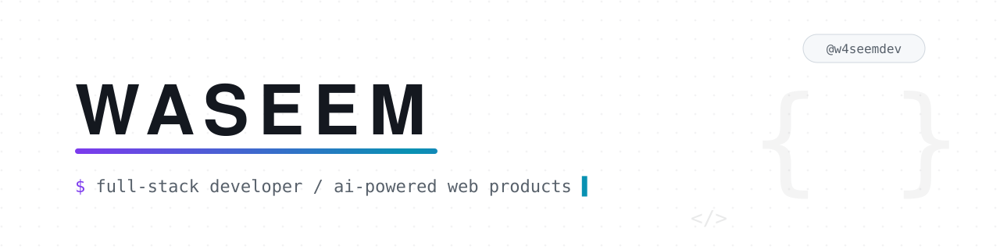

<picture>
  <source media="(prefers-color-scheme: dark)" srcset="assets/banner-dark.svg">
  
</picture>

# Waseem Abu Fares: Full-Stack React Developer

I build complete web products: React + TypeScript frontends, Supabase backends with Row-Level Security, Stripe payments, and AI features powered by the Claude API.

**Live right now:** [Templix](https://templix-peach.vercel.app) marketplace with Stripe checkout, [SplitApp](https://split-app-tawny.vercel.app) installable workout PWA, [IDEAenhancer](https://ide-aenhancer.vercel.app) AI concept generator

---

## Featured Projects

### [Templix](https://github.com/w4seemdev/Templix): premium website template marketplace

**[LIVE DEMO → templix-peach.vercel.app](https://templix-peach.vercel.app)**

Browse 61 original templates, preview each one live, and buy securely through Stripe.

- Server-side pricing: customers cannot tamper with prices or download without paying. The client sends only a template id; price and buyer identity are resolved server-side (catalog + verified JWT), and downloads are ownership-gated behind signed URLs.
- **Tech:** React 19 · TypeScript · Vite · Tailwind CSS 4 · Supabase (Auth, Postgres, Storage, Edge Functions) · Stripe

### [SplitApp](https://github.com/w4seemdev/SplitApp): workout split planner & tracker

**[LIVE DEMO → split-app-tawny.vercel.app](https://split-app-tawny.vercel.app)**

An installable PWA for planning training splits and logging workouts, with offline-resilient set logging synced to Supabase.

- Resilient write pipeline: sets logged mid-workout are never lost, even if the tab closes. A debounced write-through to Supabase flushes automatically on close.
- **Tech:** React 18 · Vite · Supabase (Postgres + Auth, RLS) · Workbox PWA

### [IDEAenhancer](https://github.com/w4seemdev/IDEAenhancer): AI product-concept generator

**[LIVE DEMO → ide-aenhancer.vercel.app](https://ide-aenhancer.vercel.app)**

Turn one scrappy line into four fully developed product concepts with AI.

- Guaranteed-shape AI output: strict structured outputs from the Claude API, validated on both server and client, with rate limiting and a demo-mode fallback when no API key is configured.
- **Tech:** React 19 · TypeScript (strict) · Vite · Tailwind CSS 4 · Claude API · Vercel serverless

---

## What I Can Build For You

- **React / TypeScript web apps**: fast SPAs and installable PWAs with code splitting, accessibility, and strict typing, shipped in [Templix](https://github.com/w4seemdev/Templix) and [SplitApp](https://github.com/w4seemdev/SplitApp)
- **Supabase backends**: authentication, Postgres with Row-Level Security, storage, and edge functions, running in [Templix](https://github.com/w4seemdev/Templix) and [DataDojo](https://github.com/w4seemdev/datadojo)
- **Stripe payment flows**: secure checkout with server-side pricing and signature-verified webhook fulfilment, shipped in [Templix](https://github.com/w4seemdev/Templix)
- **AI features with the Claude API**: structured outputs, rate limiting, and graceful degradation when keys or quotas run out, live in [IDEAenhancer](https://github.com/w4seemdev/IDEAenhancer)

---

## AI, ML & Automation

Beyond the frontend: a trained model, an autonomous pipeline, and a safety-conscious agent.

| Project | Why it matters |
| --- | --- |
| [YouTubeAnalysisProject](https://github.com/w4seemdev/YouTubeAnalysisProject) | Trained XGBoost model with 15 engineered features (length and ratio signals, description quality, tag density), served by FastAPI with a React dashboard: I can take a model from raw data to a working product |
| [AiSpaceShortsAgent](https://github.com/w4seemdev/AiSpaceShortsAgent) | Autonomous end-to-end pipeline: LLM script, TTS narration, word-synced captions, auto-upload, the whole production runs without a human |
| [Auto-Fill-Forms](https://github.com/w4seemdev/Auto-Fill-Forms) | Human-in-the-loop agent design: the agent fills the form, the human always clicks Submit, with prompt-injection defenses built in |

**Also on my profile:** [AiNews](https://github.com/w4seemdev/AiNews) daily AI news site rebuilt by scheduled GitHub Actions, [DataDojo](https://github.com/w4seemdev/datadojo) crowdsourced AI-training-data platform, [GameDashBoard](https://github.com/w4seemdev/GameDashBoard) RAWG game discovery dashboard

---

## Tech Stack

React 19 · TypeScript (strict) · Node.js · Vite · Tailwind CSS 4 · Supabase (Postgres, RLS, Edge Functions) · Stripe · Claude API · Python · FastAPI · Playwright · Vitest · GitHub Actions · Vercel

---

## Work With Me

**Available for freelance work**: React apps, Supabase backends, Stripe integrations, and AI features.

How I work: clear milestones agreed up front, regular progress updates, and full source handover with documentation. I work in English and Arabic.

The fastest way to reach me: open an issue on the project closest to what you need. I reply on GitHub.

The project links above go deeper: every README documents the architecture and how to run it locally.
